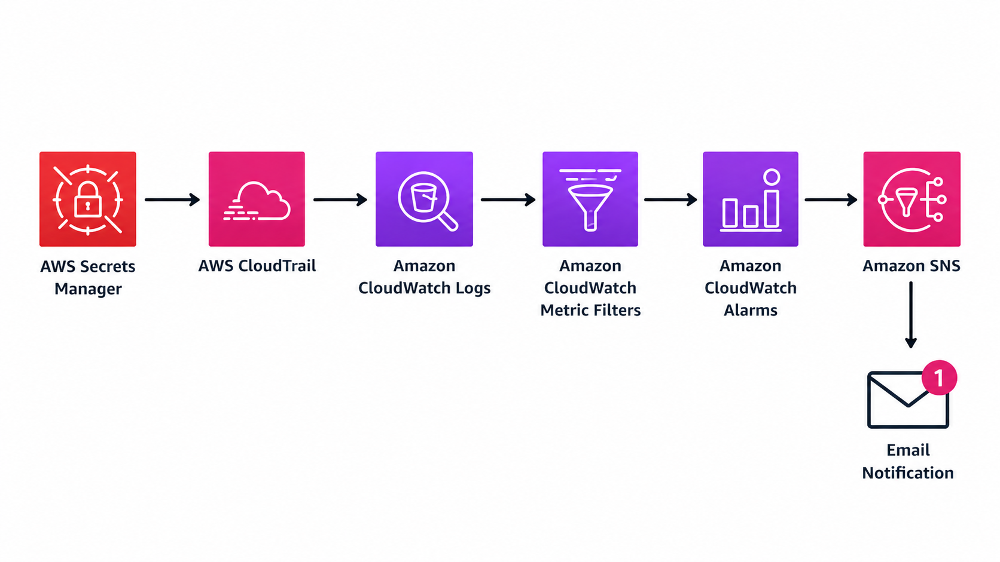
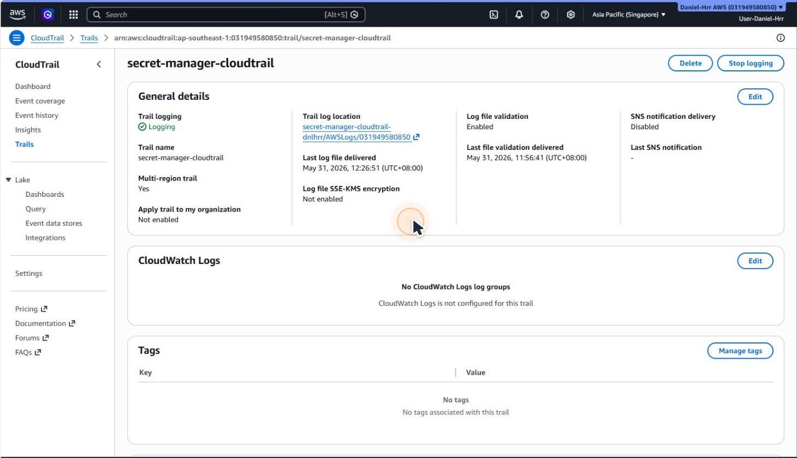
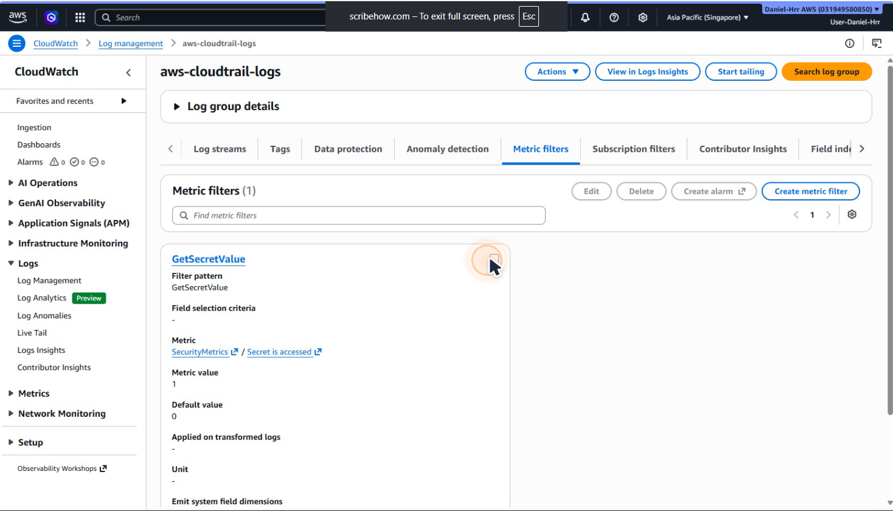
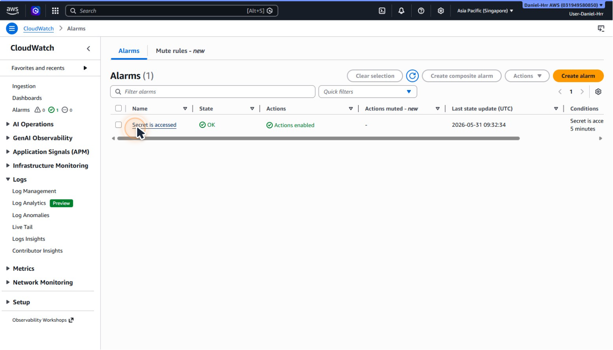
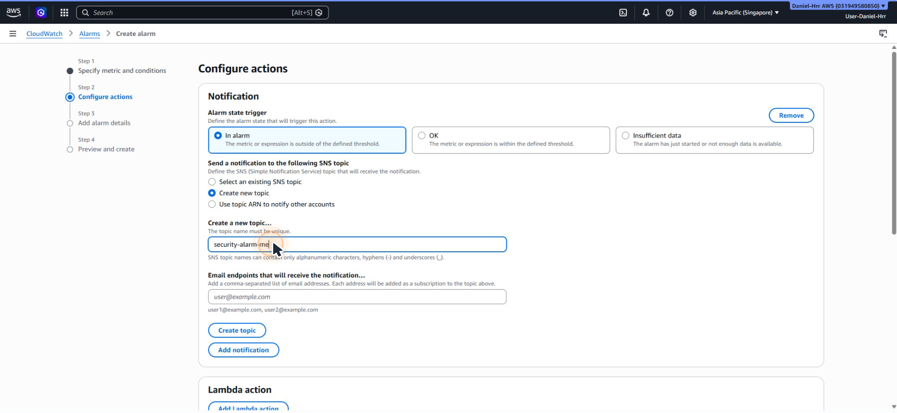
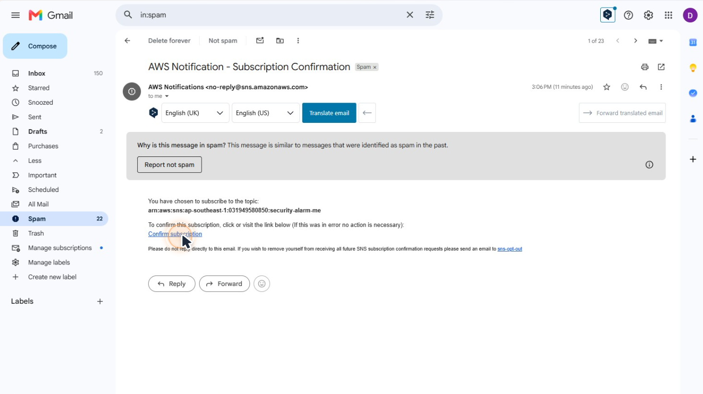
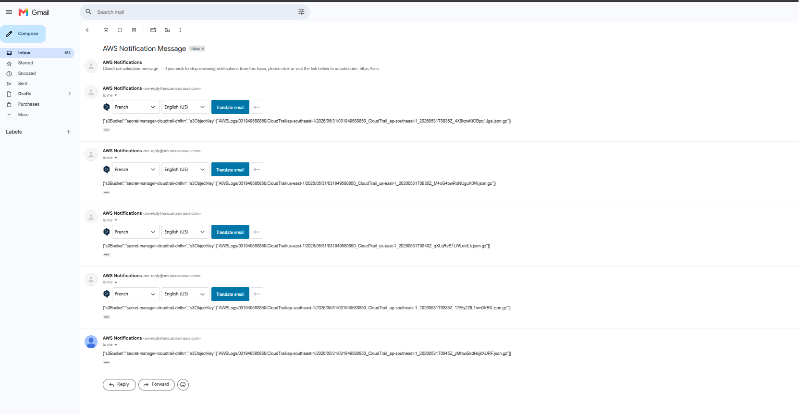

# Monitoring-AWS-Secrets-Manager-Access-with-CloudTrail-and-CloudWatch

## Overview

## Architecture Diagram
This architecture demonstrates how AWS CloudTrail, CloudWatch, and SNS work together to detect and notify administrators when a secret is accessed in AWS Secrets Manager.

## Services Used
- Secret Manager
- Cloud Trail
- Cloud Watch

## Implementation Steps

1. Create a secret in AWS Secrets Manager.
2. Enable AWS CloudTrail logging.
3. Configure a CloudWatch Metric Filter for GetSecretValue events.
4. Create a CloudWatch Alarm based on the metric.
5. Configure an SNS topic and email subscription.
6. Retrieve the secret to generate a CloudTrail event.
7. Verify that the alarm and notification are triggered successfully.

## CloudTrail Configuration
AWS CloudTrail was configured to record API activity across the AWS account, including access events related to AWS Secrets Manager.

## CloudWatch Metric Filter
A CloudWatch Metric Filter was created to detect GetSecretValue API calls generated when a secret is accessed.

## CloudWatch Alarm
A CloudWatch Alarm was configured to trigger whenever a secret access event was detected by the metric filter.

## SNS Topic
An SNS topic was created to distribute notifications when the CloudWatch alarm enters the ALARM state.

## Email Subscription
An email subscription was attached to the SNS topic to deliver real-time notifications to the administrator.

## Validation
A test secret retrieval generated a CloudTrail event, triggered the CloudWatch alarm, and successfully delivered an SNS email notification.

## Skills Demonstrated

- AWS CloudTrail
- Amazon CloudWatch
- Amazon SNS
- AWS Secrets Manager
- Security Monitoring
- Event Detection
- Alerting and Notification
- Cloud Security Fundamentals
